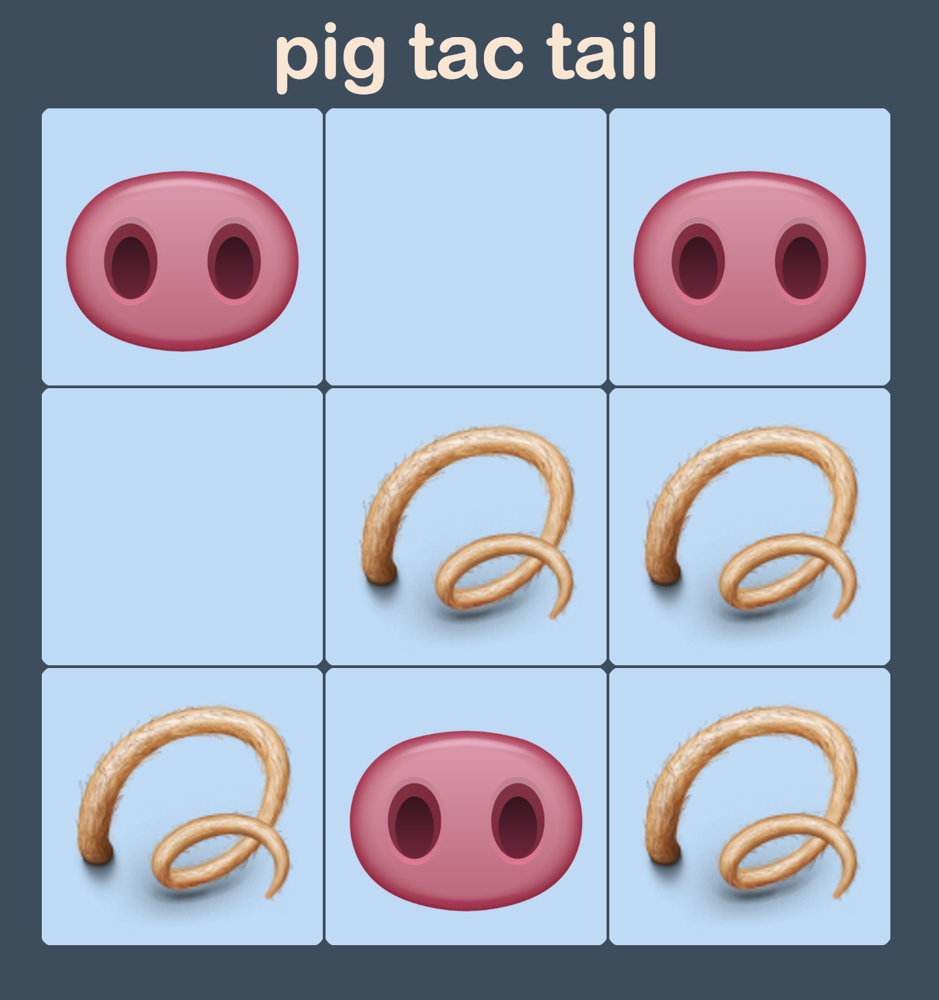

# Pig

#### Epicodus | 08.19.16
###### _By **Kyle Fisher** and **Peter Armington**_
---
---

https://github.com/FisherKyle/pig-tac-toe-js.git
## **//** Description

A front end app that simulates a game of tic-tac-toe.

## **//** Installation Requirements/Instructions

1. Clone the repository found at https://github.com/FisherKyle/tic-tac-toe.git
2. Open the file titled "index.html" in your web browser.

_Or_, using your web browser, navigate to the gh-page: https://fisherkyle.github.io/tic-tac-toe/

## **//** Support and contact details

Contact kyle@kylefisher.com or peter.armington@gmail.com for more information.

## **//** Technologies Used

* HTML
* CSS
* Bootstrap
* JQuery
* Javascript

#### **//** **Specifications**
**___________________________________________________________**

* User one clicks on any space on an empty 3 x 3 tiled game board to place a mark.
  * example input: User clicks a space.
  * example output: An "x" remains in that space. Space now unclickable.

### License

Copyright (c) 2016 **Kyle Fisher, Peter Armington **//** www.kylefisher.com
